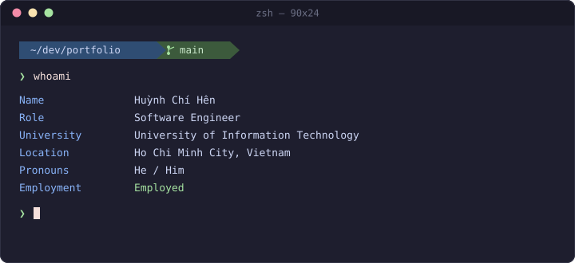

  

## About Me

<table>

<tr>

<td width="60%" valign="top">

</td>

<td width="40%" align="center" valign="middle">

<i>I like Usagi</i>

</td>

</tr>

</table>
## Featured

<table>
<tr>
<td width="50%" valign="top">

<h3 align="center"> Idest</h3>

AI-powered IELTS learning platform that combines online classrooms, automated assessment, and comprehensive practice materials. Designed to provide a complete digital learning experience with scalable backend services.

<b>Key Features:</b>

<ul>
<li>📚 Digital library of IELTS practice tests</li>
<li>🤖 ML-powered Speaking & Writing score prediction</li>
<li>🎥 Real-time online classrooms using WebRTC</li>
<li>⚡ Asynchronous grading pipeline with RabbitMQ</li>
</ul>

</td>

<td width="50%" valign="top">

<h3 align="center"> Cocono </h3>

<i>🚧 Under Development 🏗️</i>

Enterprise Resource Planning system for a fictional cosmetics manufacturer, covering procurement, inventory management, logistics operations, and business document workflows in a modular architecture.

<b>Key Features:</b>

<ul>
<li>📦 Multi-warehouse inventory management (WM)</li>
<li>🛒 Procurement and supplier sourcing workflow</li>
<li>🚚 Logistics and distribution planning</li>
<li>📄 Business documents with approval workflow</li>
</ul>

</td>
</tr>

<tr>
<td width="50%" valign="top">

<h3 align="center"> UIT-GO</h3>

Microservice-based ride-hailing platform built with event-driven communication, standardized authentication, and real-time notifications for scalable transportation services.

<b>Key Features:</b>

<ul>
<li>🔔 Real-time notification service with WebSockets</li>
<li>📨 Event-driven messaging via RabbitMQ</li>
<li>🔐 Shared RSA-based JWT authentication</li>
<li>🗄️ PostgreSQL primary–replica deployment</li>
</ul>

</td>

<td width="50%" valign="top">

<!-- Future project -->

</td>
</tr>
</table>

<table width="100%">
<tr>

<td width="75%" align="center" valign="top">

## Tech Stack

</td>

<td width="25%" align="center" valign="top">

## Listen With Me

</td>

</tr>
</table>

